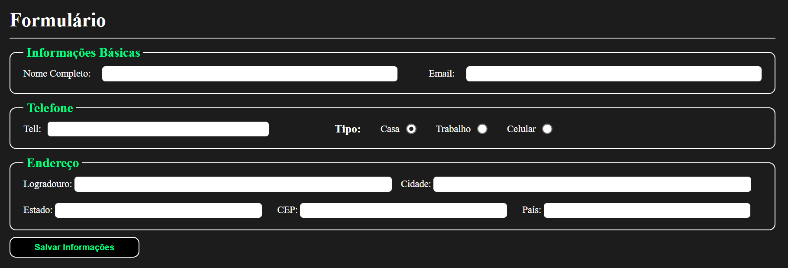

<h1 align="center"> Exercício do Formulário </h1>

Exercício do formulário requisitado nas aulas da AdaTech para melhor entendimento da manipulação de dados do formulário através da classe formData do JS. 

 

  

## 🚀 Tecnologias

Esse projeto foi desenvolvido com as seguintes tecnologias:

- HTML e CSS
- JavaScript
- Git e Github

## 💻 Projeto

O exercício do formulário foi desenvolvido para melhorar as habilidades relaciondas a criação de formulários HTML, e manipulação desses dados pelo JS através da class FormData.

## Créditos

Feito por Dário Klein.
